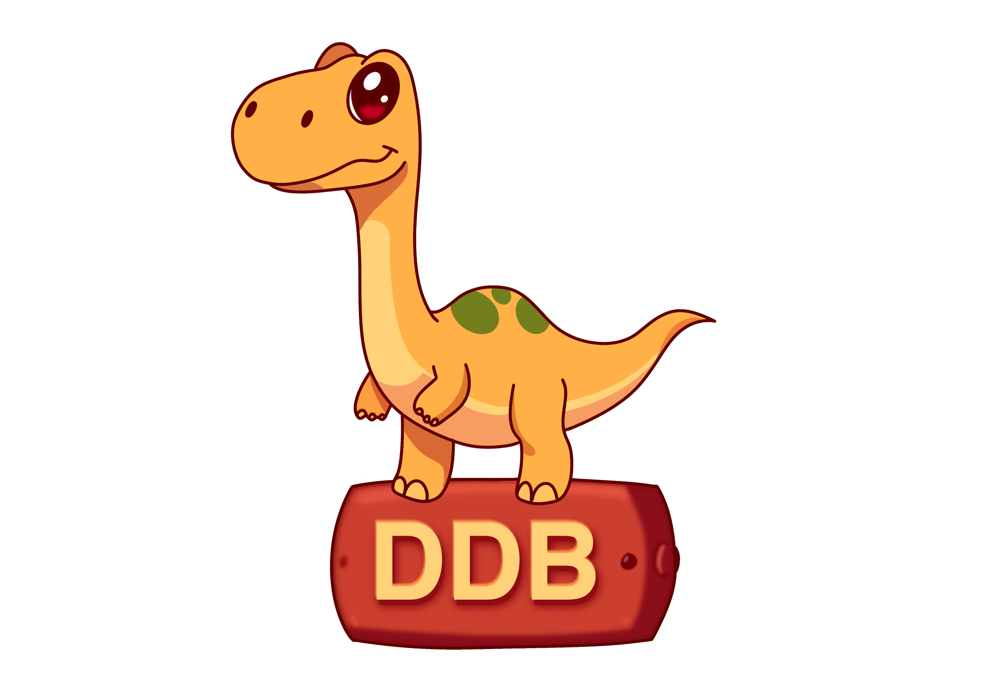

# 🦖 dyno-table [](https://www.npmjs.com/package/dyno-table) [](https://opensource.org/licenses/MIT)

**A type-safe, fluent interface for DynamoDB single-table designs**  
*Tame the NoSQL wilderness with a robust abstraction layer that brings order to DynamoDB operations*



```ts
// Type-safe DynamoDB operations made simple
await table
  .update<Dinosaur>({
    pk: 'SPECIES#trex',
    sk: 'PROFILE#001'
  })
  .set('diet', 'Carnivore')
  .add('sightings', 1)
  .condition(op => op.eq('status', 'ACTIVE'))
  .execute();
```

## 🌟 Why dyno-table?

- **🧩 Single-table design made simple** - Clean abstraction layer for complex DynamoDB patterns
- **🛡️ Type-safe operations** - Full TypeScript support with strict type checking
- **⚡ Fluent API** - Chainable builder pattern for complex operations
- **🔒 Transactional safety** - ACID-compliant operations with easy-to-use transactions
- **📈 Scalability built-in** - Automatic batch chunking and pagination handling

## 📑 Table of Contents

- [Installation](#-installation)
- [Quick Start](#-quick-start)
- [Query](#-type-safe-query-building)
- [Update](#update-operations)
  - [Condition Operators](#condition-operators)
  - [Multiple Operations](#multiple-operations)
- [Type Safety Features](#-type-safety-features)
  - [Nested Object Support](#nested-object-support)
  - [Type-Safe Conditions](#type-safe-conditions)
- [Batch Operations](#-batch-operations)
  - [Batch Get](#batch-get)
  - [Batch Write](#batch-write)
- [Transaction Operations](#-transaction-operations)
  - [Transaction Builder](#transaction-builder)
  - [Transaction Options](#transaction-options)
- [Error Handling](#-error-handling)
- [API Reference](#-api-reference)

## 📦 Installation

```bash
npm install dyno-table
```

*Note: Requires AWS SDK v3 as peer dependency*

```bash
npm install @aws-sdk/client-dynamodb @aws-sdk/lib-dynamodb
```

## 🚀 Quick Start

### 1. Configure Your Table

```ts
import { DynamoDBClient } from "@aws-sdk/client-dynamodb";
import { DynamoDBDocument } from "@aws-sdk/lib-dynamodb";
import { Table } from "dyno-table";

// Configure AWS SDK clients
const client = new DynamoDBClient({ region: "us-west-2" });
const docClient = DynamoDBDocument.from(client);

// Initialize table with single-table design schema
const dinoTable = new Table({
  client: docClient,
  tableName: "DinosaurPark",
  indexes: {
    partitionKey: "pk",
    sortKey: "sk",
    gsis: {
      speciesId: {
        partitionKey: "gsi1pk",
        sortKey: "gsi1sk",
      },
    },
  },
});
```

### 2. Perform Type-Safe Operations

**🦖 Creating a new dinosaur**
```ts
const rex = await dinoTable
  .create<Dinosaur>({
    pk: "SPECIES#trex",
    sk: "PROFILE#trex",
    speciesId: "trex",
    name: "Tyrannosaurus Rex",
    diet: "carnivore",
    length: 12.3,
    discoveryYear: 1902
  })
  .execute();
```

**🔍 Query with conditions**
```ts
const largeDinos = await dinoTable
  .query<Dinosaur>({ 
    pk: "SPECIES#trex",
    sk: (op) => op.beginsWith("PROFILE#")
  })
  .filter((op) => op.and(
    op.gte("length", 10),
    op.eq("diet", "carnivore")
  ))
  .limit(10)
  .execute();
```

**🔄 Complex update operation**
```ts
await dinoTable
  .update<Dinosaur>({ 
    pk: "SPECIES#trex", 
    sk: "PROFILE#trex" 
  })
  .set("diet", "omnivore")
  .add("discoveryYear", 1)
  .remove("outdatedField")
  .condition((op) => op.attributeExists("discoverySite"))
  .execute();
```

## 🧩 Advanced Features

### Transactional Operations

**Safe dinosaur transfer between enclosures**
```ts
// Start a transaction session for transferring a dinosaur
await dinoTable.transaction(async (tx) => {
  // All operations are executed as a single transaction (up to 100 operations)

  // Check if destination enclosure is ready and compatible
  await dinoTable
    .conditionCheck({ 
      pk: "ENCLOSURE#B", 
      sk: "STATUS" 
    })
    .condition(op => op.and(
      op.eq("status", "READY"),
      op.eq("diet", "Carnivore")  // Ensure enclosure matches dinosaur diet
    ))
    .withTransaction(tx);

  // Remove dinosaur from current enclosure
  await dinoTable
    .delete<Dinosaur>({ 
      pk: "ENCLOSURE#A", 
      sk: "DINO#001" 
    })
    .condition(op => op.and(
      op.eq("status", "HEALTHY"),
      op.gte("health", 80)  // Only transfer healthy dinosaurs
    ))
    .withTransaction(tx);

  // Add dinosaur to new enclosure
  await dinoTable
    .create<Dinosaur>({
      pk: "ENCLOSURE#B",
      sk: "DINO#001",
      name: "Rex",
      species: "Tyrannosaurus",
      diet: "Carnivore",
      status: "HEALTHY",
      health: 100,
      enclosureId: "B",
      lastFed: new Date().toISOString()
    })
    .withTransaction(tx);

  // Update enclosure occupancy tracking
  await dinoTable
    .update<Dinosaur>({ 
      pk: "ENCLOSURE#B", 
      sk: "OCCUPANCY" 
    })
    .add("currentOccupants", 1)
    .set("lastUpdated", new Date().toISOString())
    .withTransaction(tx);
});

// Transaction with feeding and health monitoring
await dinoTable.transaction(
  async (tx) => {
    // Update dinosaur health and feeding status
    await dinoTable
      .update<Dinosaur>({
        pk: "ENCLOSURE#D",
        sk: "DINO#003"
      })
      .set({
        status: "HEALTHY",
        lastFed: new Date().toISOString(),
        health: 100
      })
      .deleteElementsFromSet("tags", ["needs_feeding"])
      .withTransaction(tx);

    // Update enclosure feeding schedule
    await dinoTable
      .update<Dinosaur>({
        pk: "ENCLOSURE#D",
        sk: "SCHEDULE"
      })
      .set("nextFeedingTime", new Date(Date.now() + 24 * 60 * 60 * 1000).toISOString())
      .withTransaction(tx);
  },
  {
    clientRequestToken: "feeding-session-001",
    returnConsumedCapacity: "TOTAL"
  }
);
```

**Benefits of this transaction approach:**
- 🔄 Uses the same familiar API as non-transactional operations
- 🧠 Maintains consistent mental model for developers
- 🔒 All operations within the callback are executed as a single transaction
- ✅ All-or-nothing operations (ACID compliance)
- 🛡️ Prevents race conditions and data inconsistencies
- 📊 Supports up to 100 actions per transaction

### Batch Processing

**Efficient dinosaur park management with bulk operations**
```ts
// Batch health check for multiple dinosaurs
const healthCheckKeys = [
  { pk: "ENCLOSURE#A", sk: "DINO#001" }, // T-Rex
  { pk: "ENCLOSURE#B", sk: "DINO#002" }, // Velociraptor
  { pk: "ENCLOSURE#C", sk: "DINO#003" }  // Stegosaurus
];

const { items: dinosaurs, unprocessedKeys } = await dinoTable.batchGet<Dinosaur>(healthCheckKeys);
console.log(`Health check completed for ${dinosaurs.length} dinosaurs`);
dinosaurs.forEach(dino => {
  if (dino.health < 80) {
    console.log(`Health alert for ${dino.name} in Enclosure ${dino.enclosureId}`);
  }
});

// Batch update feeding schedule for herbivore group
const newHerbivores = [
  {
    pk: "ENCLOSURE#D", sk: "DINO#004",
    name: "Triceratops Alpha",
    species: "Triceratops",
    diet: "Herbivore",
    status: "HEALTHY",
    health: 95,
    lastFed: new Date().toISOString()
  },
  {
    pk: "ENCLOSURE#D", sk: "DINO#005",
    name: "Brachy",
    species: "Brachiosaurus",
    diet: "Herbivore",
    status: "HEALTHY",
    health: 90,
    lastFed: new Date().toISOString()
  }
];

// Add new herbivores to enclosure
await dinoTable.batchWrite(
  newHerbivores.map(dino => ({
    type: "put",
    item: dino
  }))
);

// Mixed operations: relocate dinosaurs and update enclosure status
await dinoTable.batchWrite([
  // Remove dinosaur from quarantine
  { type: "delete", key: { pk: "ENCLOSURE#QUARANTINE", sk: "DINO#006" } },
  // Add recovered dinosaur to main enclosure
  { 
    type: "put", 
    item: {
      pk: "ENCLOSURE#E", sk: "DINO#006",
      name: "Raptor Beta",
      species: "Velociraptor",
      diet: "Carnivore",
      status: "HEALTHY",
      health: 100,
      lastFed: new Date().toISOString()
    }
  },
  // Clear quarantine status
  { type: "delete", key: { pk: "ENCLOSURE#QUARANTINE", sk: "STATUS#DINO#006" } }
]);

// Handle large-scale park operations
// (25 items per batch write, 100 items per batch get)
const dailyHealthUpdates = generateDinosaurHealthUpdates(); // Hundreds of updates
await dinoTable.batchWrite(dailyHealthUpdates); // Automatically chunked
```

### Pagination Made Simple

**Efficient dinosaur record browsing**
```ts
// Create a paginator for viewing herbivores by health status
const healthyHerbivores = dinoTable
  .query<Dinosaur>({
    pk: "DIET#herbivore",
    sk: op => op.beginsWith("STATUS#HEALTHY")
  })
  .filter((op) => op.and(
    op.gte("health", 90),
    op.attributeExists("lastFed")
  ))
  .paginate(5); // View 5 dinosaurs at a time

// Monitor all enclosures page by page
while (healthyHerbivores.hasNextPage()) {
  const page = await healthyHerbivores.getNextPage();
  console.log(`Checking herbivores page ${page.page}, found ${page.items.length} dinosaurs`);
  page.items.forEach(dino => {
    console.log(`${dino.name}: Health ${dino.health}%, Last fed: ${dino.lastFed}`);
  });
}

// Get all carnivores for daily feeding schedule
const carnivoreSchedule = await dinoTable
  .query<Dinosaur>({
    pk: "DIET#carnivore",
    sk: op => op.beginsWith("ENCLOSURE#")
  })
  .filter(op => op.attributeExists("lastFed"))
  .paginate(10)
  .getAllPages();

console.log(`Scheduling feeding for ${carnivoreSchedule.length} carnivores`);

// Limited view for visitor information kiosk
const visitorKiosk = dinoTable
  .query<Dinosaur>({ 
    pk: "VISITOR_VIEW",
    sk: op => op.beginsWith("SPECIES#")
  })
  .filter(op => op.eq("status", "ON_DISPLAY"))
  .limit(12) // Show max 12 dinosaurs per view
  .paginate(4); // Display 4 at a time

// Get first page for kiosk display
const firstPage = await visitorKiosk.getNextPage();
console.log(`Now showing: ${firstPage.items.map(d => d.name).join(", ")}`);
```

## 🛡️ Type-Safe Query Building

Dyno-table provides comprehensive query methods that match DynamoDB's capabilities while maintaining type safety:

### Comparison Operators

| Operation                 | Method Example                                          | Generated Expression              |
|---------------------------|---------------------------------------------------------|-----------------------------------|
| **Equals**                | `.filter(op => op.eq("status", "ACTIVE"))`              | `status = :v1`                    |
| **Not Equals**            | `.filter(op => op.ne("status", "DELETED"))`             | `status <> :v1`                   |
| **Less Than**             | `.filter(op => op.lt("age", 18))`                       | `age < :v1`                       |
| **Less Than or Equal**    | `.filter(op => op.lte("score", 100))`                   | `score <= :v1`                    |
| **Greater Than**          | `.filter(op => op.gt("price", 50))`                     | `price > :v1`                     |
| **Greater Than or Equal** | `.filter(op => op.gte("rating", 4))`                    | `rating >= :v1`                   |
| **Between**               | `.filter(op => op.between("age", 18, 65))`              | `age BETWEEN :v1 AND :v2`         |
| **Begins With**           | `.filter(op => op.beginsWith("email", "@example.com"))` | `begins_with(email, :v1)`         |
| **Contains**              | `.filter(op => op.contains("tags", "important"))`       | `contains(tags, :v1)`             |
| **Attribute Exists**      | `.filter(op => op.attributeExists("email"))`            | `attribute_exists(email)`         |
| **Attribute Not Exists**  | `.filter(op => op.attributeNotExists("deletedAt"))`     | `attribute_not_exists(deletedAt)` |
| **Nested Attributes**     | `.filter(op => op.eq("address.city", "London"))`        | `address.city = :v1`              |

### Logical Operators

| Operation | Method Example                                                                    | Generated Expression           |
|-----------|-----------------------------------------------------------------------------------|--------------------------------|
| **AND**   | `.filter(op => op.and(op.eq("status", "ACTIVE"), op.gt("age", 18)))`              | `status = :v1 AND age > :v2`   |
| **OR**    | `.filter(op => op.or(op.eq("status", "PENDING"), op.eq("status", "PROCESSING")))` | `status = :v1 OR status = :v2` |
| **NOT**   | `.filter(op => op.not(op.eq("status", "DELETED")))`                               | `NOT status = :v1`             |

### Query Operations

| Operation                | Method Example                                                                       | Generated Expression                  |
|--------------------------|--------------------------------------------------------------------------------------|---------------------------------------|
| **Partition Key Equals** | `.query({ pk: "USER#123" })`                                                         | `pk = :pk`                            |
| **Sort Key Begins With** | `.query({ pk: "USER#123", sk: op => op.beginsWith("ORDER#2023") })`                  | `pk = :pk AND begins_with(sk, :v1)`   |
| **Sort Key Between**     | `.query({ pk: "USER#123", sk: op => op.between("ORDER#2023-01", "ORDER#2023-12") })` | `pk = :pk AND sk BETWEEN :v1 AND :v2` |

Additional query options:
```ts
// Sort order
const ascending = await table
  .query({ pk: "USER#123" })
  .sortAscending()
  .execute();

const descending = await table
  .query({ pk: "USER#123" })
  .sortDescending()
  .execute();

// Projection (select specific attributes)
const partial = await table
  .query({ pk: "USER#123" })
  .select(["name", "email"])
  .execute();

// Limit results
const limited = await table
  .query({ pk: "USER#123" })
  .limit(10)
  .execute();
```

### Update Operations

| Operation            | Method Example                                        | Generated Expression |
|----------------------|-------------------------------------------------------|----------------------|
| **Set Attributes**   | `.update(key).set("name", "New Name")`                | `SET #name = :v1`    |
| **Add to Number**    | `.update(key).add("score", 10)`                       | `ADD #score :v1`     |
| **Remove Attribute** | `.update(key).remove("temporary")`                    | `REMOVE #temporary`  |
| **Delete From Set**  | `.update(key).deleteElementsFromSet("tags", ["old"])` | `DELETE #tags :v1`   |

#### Condition Operators

The library supports a comprehensive set of type-safe condition operators:

| Category       | Operators                               | Example                                                                 |
|----------------|-----------------------------------------|-------------------------------------------------------------------------|
| **Comparison** | `eq`, `ne`, `lt`, `lte`, `gt`, `gte`    | `.condition(op => op.gt("age", 18))`                                    |
| **String/Set** | `between`, `beginsWith`, `contains`     | `.condition(op => op.beginsWith("email", "@example"))`                  |
| **Existence**  | `attributeExists`, `attributeNotExists` | `.condition(op => op.attributeExists("email"))`                         |
| **Logical**    | `and`, `or`, `not`                      | `.condition(op => op.and(op.eq("status", "active"), op.gt("age", 18)))` |

All operators are type-safe and will provide proper TypeScript inference for nested attributes.

#### Multiple Operations
Operations can be combined in a single update:
```ts
const result = await table
  .update({ pk: "USER#123", sk: "PROFILE" })
  .set("name", "Updated Name")
  .add("loginCount", 1)
  .remove("temporaryFlag")
  .condition(op => op.attributeExists("email"))
  .execute();
```

## 🔄 Type Safety Features

The library provides comprehensive type safety for all operations:

### Nested Object Support
```ts
interface Dinosaur {
  pk: string;
  sk: string;
  name: string;
  species: string;
  stats: {
    health: number;
    weight: number;
    length: number;
    age: number;
  };
  habitat: {
    enclosure: {
      id: string;
      section: string;
      climate: string;
    };
    requirements: {
      temperature: number;
      humidity: number;
    };
  };
  care: {
    feeding: {
      schedule: string;
      diet: string;
      lastFed: string;
    };
    medical: {
      lastCheckup: string;
      vaccinations: string[];
    };
  };
}

// TypeScript ensures type safety for all nested dinosaur attributes
await table.update<Dinosaur>({ pk: "ENCLOSURE#F", sk: "DINO#007" })
  .set("stats.health", 95) // ✓ Valid
  .set("habitat.enclosure.climate", "Tropical") // ✓ Valid
  .set("care.feeding.lastFed", new Date().toISOString()) // ✓ Valid
  .set("stats.invalid", true) // ❌ TypeScript Error: property doesn't exist
  .execute();
```

### Type-Safe Conditions
```ts
interface DinosaurMonitoring {
  species: string;
  health: number;
  lastFed: string;
  temperature: number;
  behavior: string[];
  alertLevel: "LOW" | "MEDIUM" | "HIGH";
}

await table.query<DinosaurMonitoring>({
  pk: "MONITORING",
  sk: op => op.beginsWith("ENCLOSURE#")
})
.filter(op => op.and(
  op.lt("health", "90"), // ❌ TypeScript Error: health expects number
  op.gt("temperature", 38), // ✓ Valid
  op.contains("behavior", "aggressive"), // ✓ Valid
  op.eq("alertLevel", "UNKNOWN") // ❌ TypeScript Error: invalid alert level
))
.execute();
```

## 🔄 Batch Operations

The library supports efficient batch operations for both reading and writing multiple items:

### Batch Get
```ts
const { items, unprocessedKeys } = await table.batchGet<User>([
  { pk: "USER#1", sk: "PROFILE" },
  { pk: "USER#2", sk: "PROFILE" }
]);
```

### Batch Write
```ts
const { unprocessedItems } = await table.batchWrite<User>([
  { type: "put", item: newUser },
  { type: "delete", key: { pk: "USER#123", sk: "PROFILE" } }
]);
```

## 🔒 Transaction Operations

Perform multiple operations atomically with transaction support:

### Transaction Builder
```ts
const result = await table.transaction(async (tx) => {
  // Building the expression manually
  tx.put("TableName", { pk: "123", sk: "123"}, and(op.attributeNotExists("pk"), op.attributeExists("sk")));

  // Using table to build the operation
  table
    .put({ pk: "123", sk: "123" })
    .condition((op) => {
      return op.and(op.attributeNotExists("pk"), op.attributeExists("sk"));
    })
    .withTransaction(tx);

  // Building raw condition check
  tx.conditionCheck(
    "TestTable",
    { pk: "transaction#test", sk: "condition#item" },
    eq("status", "active"),
  );

  // Using table to build the condition check
  table
    .conditionCheck({
      pk: "transaction#test",
      sk: "conditional#item",
    })
    .condition((op) => op.eq("status", "active"));
});
```

### Transaction Options
```ts
const result = await table.transaction(
  async (tx) => {
    // ... transaction operations
  },
  {
    // Optional transaction settings
    idempotencyToken: "unique-token",
    returnValuesOnConditionCheckFailure: true
  }
);
```

## 🏗️ Entity Pattern Best Practices (Coming Soon TM)

The entity implementation provides automatic type isolation:

```ts
// All operations are automatically scoped to DINOSAUR type
const dinosaur = await dinoEntity.get("SPECIES#trex", "PROFILE#trex"); 
// Returns Dinosaur | undefined

// Cross-type operations are prevented at compile time
dinoEntity.create({ /* invalid shape */ }); // TypeScript error
```

**Key benefits:**
- 🚫 Prevents accidental cross-type data access
- 🔍 Automatically filters queries/scans to repository type
- 🛡️ Ensures consistent key structure across entities
- 📦 Encapsulates domain-specific query logic

## 🚨 Error Handling

**TODO:**
to provide a more clear set of error classes and additional information to allow for an easier debugging experience

## 📚 API Reference

### Condition Operators

All condition operators are type-safe and will validate against your item type. For detailed information about DynamoDB conditions and expressions, see the [AWS DynamoDB Developer Guide](https://docs.aws.amazon.com/amazondynamodb/latest/developerguide/Expressions.OperatorsAndFunctions.html).

#### Comparison Operators
- `eq(attr, value)` - Equals (=)
- `ne(attr, value)` - Not equals (≠)
- `lt(attr, value)` - Less than (<)
- `lte(attr, value)` - Less than or equal to (≤)
- `gt(attr, value)` - Greater than (>)
- `gte(attr, value)` - Greater than or equal to (≥)
- `between(attr, lower, upper)` - Between two values (inclusive)
- `beginsWith(attr, value)` - Checks if string begins with value
- `contains(attr, value)` - Checks if string/set contains value

```ts
// Example: Health and feeding monitoring
await dinoTable
  .query<Dinosaur>({
    pk: "ENCLOSURE#G"
  })
  .filter((op) => op.and(
    op.lt("stats.health", 85),  // Health below 85%
    op.lt("care.feeding.lastFed", new Date(Date.now() - 12 * 60 * 60 * 1000).toISOString()),  // Not fed in 12 hours
    op.between("stats.weight", 1000, 5000)  // Medium-sized dinosaurs
  ))
  .execute();
```

#### Attribute Operators
- `attributeExists(attr)` - Checks if attribute exists
- `attributeNotExists(attr)` - Checks if attribute does not exist

```ts
// Example: Validate required attributes for dinosaur transfer
await dinoTable
  .update<Dinosaur>({
    pk: "ENCLOSURE#H", 
    sk: "DINO#008"
  })
  .set("habitat.enclosure.id", "ENCLOSURE#J")
  .condition((op) => op.and(
    // Ensure all required health data is present
    op.attributeExists("stats.health"),
    op.attributeExists("care.medical.lastCheckup"),
    // Ensure not already in transfer
    op.attributeNotExists("transfer.inProgress"),
    // Verify required monitoring tags
    op.attributeExists("care.medical.vaccinations")
  ))
  .execute();
```

#### Logical Operators
- `and(...conditions)` - Combines conditions with AND
- `or(...conditions)` - Combines conditions with OR
- `not(condition)` - Negates a condition

```ts
// Example: Complex safety monitoring conditions
await dinoTable
  .query<Dinosaur>({
    pk: "MONITORING#ALERTS"
  })
  .filter((op) => op.or(
    // Alert: Aggressive carnivores with low health
    op.and(
      op.eq("care.feeding.diet", "Carnivore"),
      op.lt("stats.health", 70),
      op.contains("behavior", "aggressive")
    ),
    // Alert: Any dinosaur not fed recently and showing stress
    op.and(
      op.lt("care.feeding.lastFed", new Date(Date.now() - 8 * 60 * 60 * 1000).toISOString()),
      op.contains("behavior", "stressed")
    ),
    // Alert: Enclosure climate issues
    op.and(
      op.not(op.eq("habitat.enclosure.climate", "Optimal")),
      op.or(
        op.gt("habitat.requirements.temperature", 40),
        op.lt("habitat.requirements.humidity", 50)
      )
    )
  ))
  .execute();
```

### Key Condition Operators

Special operators for sort key conditions in queries. See [AWS DynamoDB Key Condition Expressions](https://docs.aws.amazon.com/amazondynamodb/latest/developerguide/Query.html#Query.KeyConditionExpressions) for more details.

```ts
// Example: Query recent health checks by enclosure
const recentHealthChecks = await dinoTable
  .query<Dinosaur>({
    pk: "ENCLOSURE#K",
    sk: (op) => op.beginsWith(`HEALTH#${new Date().toISOString().slice(0, 10)}`)  // Today's checks
  })
  .execute();

// Example: Query dinosaurs by weight range in specific enclosure
const largeHerbivores = await dinoTable
  .query<Dinosaur>({
    pk: "DIET#herbivore",
    sk: (op) => op.between(
      `WEIGHT#${5000}`,  // 5 tons minimum
      `WEIGHT#${15000}`  // 15 tons maximum
    )
  })
  .execute();

// Example: Find all dinosaurs in quarantine by date range
const quarantinedDinos = await dinoTable
  .query<Dinosaur>({
    pk: "STATUS#quarantine",
    sk: (op) => op.between(
      `DATE#${new Date(Date.now() - 7 * 24 * 60 * 60 * 1000).toISOString().slice(0, 10)}`,  // Last 7 days
      `DATE#${new Date().toISOString().slice(0, 10)}`  // Today
    )
  })
  .execute();
```

Available key conditions for dinosaur queries:
- `eq(value)` - Exact match (e.g., specific enclosure)
- `lt(value)` - Earlier than date/time
- `lte(value)` - Up to and including date/time
- `gt(value)` - Later than date/time
- `gte(value)` - From date/time onwards
- `between(lower, upper)` - Range (e.g., weight range, date range)
- `beginsWith(value)` - Prefix match (e.g., all health checks today)

## 🔮 Future Roadmap

- [ ] Enhanced query plan visualization
- [ ] Migration tooling
- [ ] Local secondary index support
- [ ] Multi-table transaction support

## 🤝 Contributing

```bash
# Set up development environment
pnpm install

# Run tests (requires local DynamoDB)
pnpm run ddb:start
pnpm test

# Build the project
pnpm build
```
