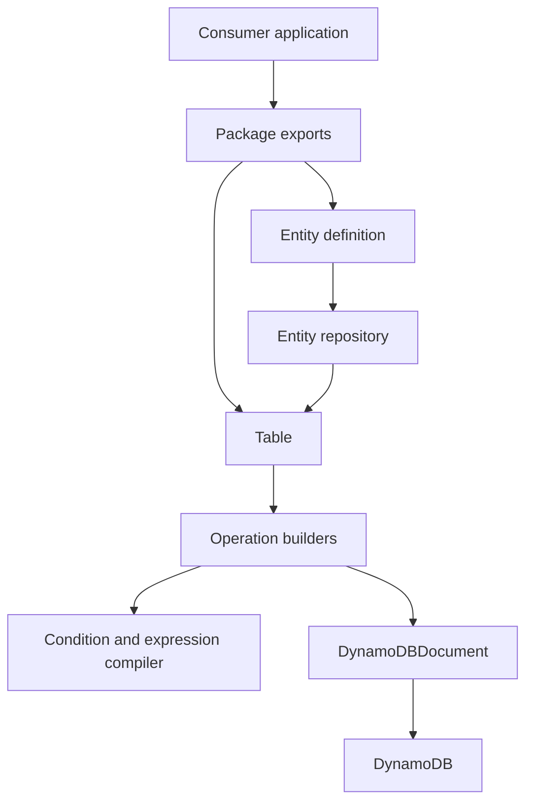

# dyno-table architecture

`dyno-table` is a TypeScript library—not a deployed application—that layers typed, fluent DynamoDB operations over `@aws-sdk/lib-dynamodb`'s `DynamoDBDocument`. Its two intended consumption styles share the same runtime:

1. **Table-first:** construct [`Table`](../table/operations.md) and use low-level get, put, update, delete, query, scan, batch, and transaction builders.
2. **Entity-first:** define a schema-backed entity, then create a repository that validates data, derives keys/index attributes, scopes reads, and delegates to the same Table builders. See [entity repositories](../entities/repositories.md).

This shows the shared runtime path: entity operations add policy and data preparation before using Table-created builders.

## Source ownership map

| Concern | Owning source and symbols | Relationship |
|---|---|---|
| Package/API composition | `src/index.ts`, `src/table.ts`, `src/entity.ts`, `src/builders.ts` | `src/index.ts` is the broad root surface; subpath modules offer narrower imports. |
| DynamoDB facade | `src/table.ts` — `Table` | Stores configured physical key names and GSIs; creates builders with AWS-call executors. |
| Fluent commands | `src/builders/` | Holds command construction, lazy result iteration, pagination, batching, and transactional composition. |
| Expression language | `src/conditions.ts`, `src/expression.ts` | Defines condition ASTs and compiles placeholders for Table and builders. |
| Entity abstraction | `src/entity/` | Defines schema/index DSL, repository factory, item preparation, and entity-aware wrappers. |
| Shared contracts | `src/types.ts`, `src/standard-schema.ts`, `src/errors.ts`, `src/utils/` | Defines Table configuration, Standard Schema v1 compatibility, errors, templates, diagnostics, and helper guards. |

## Dependency direction and boundaries

`TableConfig` requires a DocumentClient, table name, physical partition/sort key names, and optionally a named GSI map. The package intentionally does **not** create AWS clients, tables, indexes, or migrations; those remain consumer/infrastructure responsibilities. The Table facade converts logical `{ pk, sk }` input into configured physical attribute names before calling DocumentClient methods.

Entity definitions depend on a `Table` only when `createRepository(table)` is called. The definition itself keeps its name, Standard Schema v1 validator, primary index function, optional GSI definitions, named query definitions, and timestamp settings. This separation lets consumers reuse one definition with compatible table instances.

## Public entrypoints and build boundary

`package.json` exports the root plus `./table`, `./entity`, `./conditions`, `./types`, `./standard-schema`, `./utils`, and `./builders`; `tsdown.config.ts` builds corresponding ESM, CJS, and declaration files into `dist/`. Refer to [public API and package contracts](../reference/public-api.md) before changing exports or types.

The AWS SDK packages are peer dependencies, so an integration consumer must install both `@aws-sdk/client-dynamodb` and `@aws-sdk/lib-dynamodb`. Local development uses DynamoDB Local only for integration tests; see [testing](../development/testing.md).

## Change routing

- Change how a DynamoDB request is issued or keys are translated: start with [`Table`](../table/operations.md), then the relevant builder.
- Change entity guarantees such as validation, type isolation, derived keys, or timestamps: start with [repositories](../entities/repositories.md) and [indexes/lifecycle](../entities/indexes-and-lifecycle.md).
- Change conditional/filter/update expression behavior: start with [conditions and expressions](../expressions/conditions.md).
- Change consumer importability or declarations: start with [public API](../reference/public-api.md).
