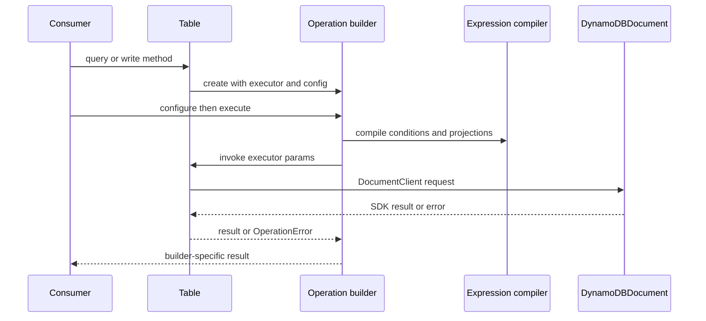

# DynamoDB execution runtime

`src/table.ts` is the runtime composition root. `new Table(config)` retains `client`, `tableName`, physical partition/sort-key attribute names, and `gsis`; every public operation captures this configuration in an executor supplied to a builder. Builders therefore own request construction while Table owns DocumentClient invocation and operation-error wrapping.

This sequence applies to the low-level path; an entity repository inserts preparation and scoping before calling its Table builder.

## Key configuration is an invariant

`TableConfig` (`src/types.ts`) names the actual table key attributes, while the public builder API uses `PrimaryKeyWithoutExpression` with `pk` and optional `sk`. `Table.createKeyForPrimaryIndex()` maps those logical properties and requires `sk` whenever the configured table has a sort key. Missing `sk` raises `ConfigurationErrors.sortKeyRequired` rather than issuing a malformed request.

The configured `gsis` map names each GSI and its physical partition/sort attributes. `Table.query()` validates `.useIndex(name)` against that map. For an indexed query it derives a replacement key condition using the GSI attributes; no GSI configuration is generated or managed by this library.

## Request families and return behavior

| Table method | AWS operation | Notable runtime behavior |
|---|---|---|
| `get` | `client.get` | Compiles projection/consistency options and returns `{ item }`; builder hides configured GSI attribute columns unless opted in. |
| `put` / `create` | `client.put` | `create` adds `attribute_not_exists(partitionKey)` and defaults to input return behavior. `put` supports `INPUT`, `CONSISTENT`, DynamoDB return options; `CONSISTENT` performs a follow-up strongly consistent get. |
| `query` | `client.query` | Compiles key condition, filter, projection, GSI, order, limit, and continuation key; returns page data to a lazy iterator. |
| `scan` | `client.scan` | Compiles filter/projection/options and returns page data to the same iterator model. |
| `delete` / `update` | `client.delete` / `client.update` | Converts logical keys and forwards compiled conditional/update expressions. |
| `batchGet` / `batchWrite` | `client.batchGet` / `client.batchWrite` | Chunks calls at 100 reads and 25 writes, collects unprocessed work for caller retry. |
| `transaction` / `transactionBuilder` | `client.transactWrite` | Gives a `TransactionBuilder` the configured physical key names; the callback form always executes after its callback completes. |

Each direct client call catches an SDK exception and creates the matching operation error through `OperationErrors`; see [errors and validation](../reference/errors-and-validation.md).

## Limits and operational implications

The Table-level chunking constants are `DDB_BATCH_WRITE_LIMIT = 25` and `DDB_BATCH_GET_LIMIT = 100`. Batch methods report unprocessed operations/keys—they do not retry them. A caller that needs retry policy must consume those arrays.

Queries and scans return a `ResultIterator`, not an in-memory array. `execute()` validates builder guards and creates the iterator; fetching happens when it is consumed. `limit` bounds yielded items across iterator pages, while DynamoDB applies page limits before filters, so a filtered operation may produce fewer matching items. See [builder execution](../builders/execution.md) for paginator, transaction, and batch semantics.

## Evidence and validation

- `src/__tests__/table-query.itest.ts` exercises query keys, filters, sorting, projection, and `findOne` against DynamoDB Local.
- `src/__tests__/table-query-advanced.itest.ts` covers continuations, paginator caps, and multi-request iteration.
- `src/__tests__/table-batch.itest.ts` verifies mixed batch operations and 30-write chunking.
- `src/__tests__/table-transaction.itest.ts` verifies transactional atomicity and condition failure.

Run focused integration tests through the local-service workflow in [testing](../development/testing.md); use `pnpm test` for builder unit coverage and `pnpm test:int` only with DynamoDB Local running.
