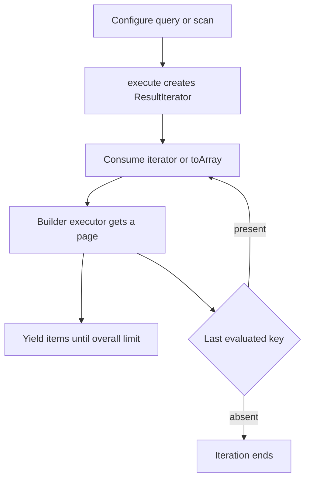

# Fluent builders, pagination, batches, and transactions

`src/builders/` converts fluent API state into DynamoDB command parameters. Table supplies executors; entity wrappers prepare items and attach entity policy. Builders are mutable during configuration, and their builders/types are exported from `dyno-table/builders` as well as selected root exports.

## Read builders: lazy pages and projections

`QueryBuilder` and `ScanBuilder` extend `FilterBuilder`. Shared methods are `limit`, `useIndex`, `consistentRead`, `filter`, `select`, `startFrom`, `paginate`, `findOne`, and `clone`; Query additionally controls `sortAscending`/`sortDescending`. `execute()` returns `ResultIterator`, an async iterable; consume it with `for await` for streaming or `.toArray()` when materializing all items is safe.

This shows why merely awaiting `execute()` does not send a query/scan; consumption drives page fetching.

`ResultIterator` keeps the most recent non-null `lastEvaluatedKey` returned by the executor. Before fetching each later page it clones/uses the source with `startFrom(lastEvaluatedKey)`; it ends only when that key is absent or its overall yielded-item `limit` has been reached. That overall yield cap is distinct from the `Limit` sent to DynamoDB for a request.

`Paginator` instead clones the source for each `getNextPage()`, applies the page size and its current continuation key, then advances page number and total retrieved count from the returned page. A returned continuation key keeps `hasNextPage()` true; an absent one marks it exhausted, so later calls have no next page to fetch. It also reduces an effective page size when an overall limit leaves fewer items. `findOne()` clones with limit one but can traverse empty filtered pages. DynamoDB evaluates the operation limit before its filter, so filters can reduce returned matches below the requested count.

[Resumable migrations](../migration-system.md) compose `Paginator` with a query or scan builder and persist each fetched page's continuation key before yielding its items. Changes to paginator page-size or continuation behavior therefore affect the migration replay boundary as well as direct consumers.

`GetBuilder` runs its optional `beforeExecute` guard immediately before its one request. It supports selection, consistent reads, optional index fields, and deferred addition to a `BatchBuilder`.

## Write and condition command rules

`PutBuilder`, `DeleteBuilder`, and `UpdateBuilder` produce command parameter objects, can attach themselves to batch/transaction builders where supported, and can provide raw/readable `debug()` output.

- `PutBuilder` defaults to `NONE`; Table's create path adjusts it to `INPUT`.
- `DeleteBuilder` defaults to returning old attributes.
- `UpdateBuilder` defaults to `ALL_NEW`, composes DynamoDB `SET`, `REMOVE`, `ADD`, and `DELETE` clauses, and rejects an empty update or undefined `set`/`add`/set-delete value.
- One update action is retained per path. Repeated numeric `ADD` values sum; repeated set `ADD`/`DELETE` values union; a different later action for a path replaces the earlier action.
- `ConditionCheckBuilder` requires a condition and can only contribute to a transaction.

Expression placeholders and typed condition callbacks are described in [conditions and expressions](../expressions/conditions.md). Entity updates layer timestamp and derived-index work on these same rules; see [entity lifecycle](../entities/indexes-and-lifecycle.md).

## Batches: efficient, non-atomic work

`BatchBuilder` is populated through builder `.withBatch()` calls; entity-aware put/delete/get wrappers synchronously prepare/register their command and pass their entity name unless the caller overrides it. Its `putWithCommand`, `deleteWithCommand`, and `getWithCommand` APIs are marked internal. `execute()` first runs all deferred get guards, then writes, then gets. It initializes an empty `itemsByType` array for each requested entity type and groups every returned item by that item's persisted `entityType` value—not by request order—so callers consume `result.reads.itemsByType.User`, etc. It also returns all items, found count, and write processed/unprocessed work. Batch work is not atomic and returned unprocessed items/keys are the caller's retry input.

`Table.batchWrite` and `Table.batchGet` perform the actual 25-write and 100-read chunking. `BatchBuilder` itself declares those limits but does not independently split/enforce them, so preserve Table executors when changing batch composition. It throws for an empty batch; failures may be collected in `errors` alongside partial results, while a critical all-side failure throws the first `BatchError`.

## Transactions: one atomic write request

`TransactionBuilder` accepts Put, Delete, Update, and ConditionCheck items via direct methods or builder-produced commands. It maps them to `TransactWriteCommandInput`, forwards `clientRequestToken`, consumed-capacity, and item-collection options, then invokes `transactWrite` once. `Table.transaction(callback, options)` builds a transaction, runs the callback, and always executes it afterward.

Builder-produced `UpdateCommandParams`, `DeleteCommandParams`, and `ConditionCheckCommandParams` may still carry logical `{ pk, sk }` keys. The corresponding `*WithCommand` methods normalize those keys to configured physical attributes before duplicate checking and insertion. Direct transaction update methods compile a supplied condition and merge its generated attribute-name/value maps with the update maps. Each item retains its own maps when `execute()` creates `TransactItems`.

The builder forbids more than one item targeting the same table primary key across Put, Update, Delete, and ConditionCheck, and validates configured partition/sort-key presence while items are added. It rejects an empty transaction and wraps executor failure in `TransactionError`. The source comment claims a 25-item limit, but `TransactionBuilder` does not enforce an item count; do not rely on that comment as local validation—DynamoDB/SDK remains the effective boundary.

## Focused tests and validation

- `src/builders/__tests__/query-builder.test.ts`: guards, selection/index-field hiding, clone isolation, iterator triggering, pagination, `findOne`, and filter composition.
- `src/builders/__tests__/update-builder.test.ts`: clause generation, same-path resolution, debugging, and undefined-value errors.
- `src/builders/__tests__/condition-check-builder.test.ts`: nested expressions and missing/invalid conditions.
- `src/__tests__/table-batch.itest.ts`, `table-transaction.itest.ts`, and `transaction-builder.itest.ts`: service-level batch chunking and transaction atomicity.

Run `pnpm test` for focused unit behavior; run `pnpm test:int` after starting DynamoDB Local for service behavior. See [testing](../development/testing.md).