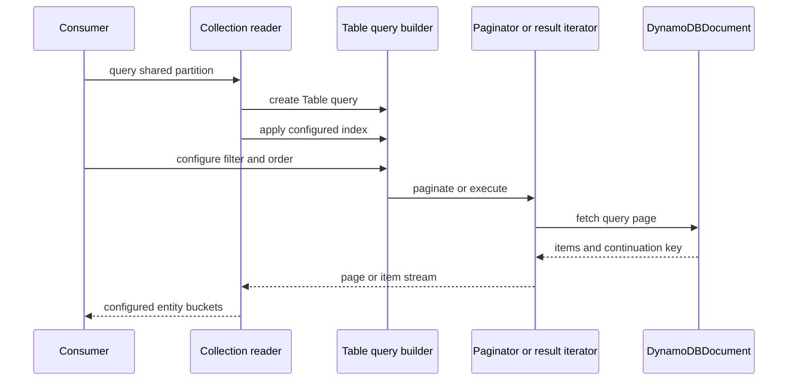

# Entity collections

`defineCollection` in `src/entity/collection.ts` is a read-only composition for a base-table partition or GSI that stores several entity types. It takes a keyed record of [entity definitions](repositories.md), decorates a normal Table query, and groups each returned item by the entity definition's `name`. It does **not** join records, eagerly load adjacent records, validate returned data, or create repositories.

Use a collection when its entities intentionally share a queryable partition; use an individual [entity repository](repositories.md) for one entity's writes, typed key lookup, lifecycle rules, and named queries. The collection reader sends the underlying request through the shared [builder execution](../builders/execution.md) layer, so normal query filters, sort direction, selection, limits, and index selection remain available.

## Definition and query flow



This shows that grouping happens after DynamoDB returns each page; it does not alter the key condition or add a DynamoDB discriminator filter.

```ts
import { defineCollection } from "dyno-table/entity";

const locationInventory = defineCollection({
  entities: { Dinosaur: DinosaurEntity, Warehouse: WarehouseEntity },
  indexName: "GSI1",
});

const pages = locationInventory
  .createReader(table)
  .query({ pk: "LOCATION#WELLINGTON" })
  .filter((op) => op.eq("status", "ACTIVE"))
  .sortDescending()
  .paginate();

for await (const page of pages) {
  // page.Dinosaur: Dinosaur[]
  // page.Warehouse: Warehouse[]
}
```

`indexName` is optional. When supplied, `createReader(table).query()` immediately calls `Table.query(...).useIndex(indexName)`; callers may subsequently apply another normal `useIndex` call because the decorated builder preserves ordinary chainable methods. The query key is still a logical `{ pk, sk? }` condition; Table maps it to the selected index's physical attributes. Design and populate the shared index through the [entity key/index lifecycle](indexes-and-lifecycle.md).

## Grouping and iteration contracts

`groupByEntityType(items, entities, entityTypeAttributeName?)` creates one array for every configured record key and maps an item into the bucket whose entity definition `name` equals its discriminator. The discriminator defaults to `entityType`; pass `entityTypeAttributeName` when the definitions use a custom discriminator. Items with an unknown or absent discriminator are omitted, and empty input/pages still contain every configured key with an empty array. Duplicate entity definition names are rejected when the collection is defined, since grouping could not choose a unique bucket.

| Terminal path | Result | Important behavior |
|---|---|---|
| `.paginate(pageSize?)` | `CollectionPageIterator` | Async-iterates `GroupedResult` pages. It uses `Paginator`, defaults `pageSize` to `25`, and exposes `getCurrentPage()` and `getAllPages()`. |
| `.paginate(...).getAllPages()` | one grouped result | Exhausts remaining paginator pages and merges their buckets; use only for a bounded result set. |
| `await .execute()` | `CollectionResultIterator` | Async-iterates individual configured items as their entity-type union. `.toArray()` exhausts it and returns a grouped result. |

The iterator owns pagination state. Do not reuse a consumed `CollectionPageIterator` or `CollectionResultIterator` to expect a fresh full result. Underlying DynamoDB filters can produce an empty page with a continuation key; a collection yields that empty grouped page and continues exactly as `Paginator` does.

## Change guide and validation

Consult this page when adding collection behavior, changing grouping semantics, or altering the query/pagination wrapper.

- Preserve the uniqueness check on `EntityDefinition.name`, configured-key completeness, and omission of unmatched types. These make the typed grouped shape sound only for the declared collection.
- Preserve the two shapes: page-wise grouping for `paginate()` and item-wise filtered streaming for `execute()`. `CollectionResultIterator.toArray()` is the grouping operation on the execute path.
- Preserve normal `QueryBuilder` chaining and the optional initial `indexName`; collection code should not duplicate query compilation or DynamoDB calls.
- If changing continuation behavior, update the underlying [builder execution](../builders/execution.md) contract and assess [resumable migrations](../migration-system.md), which also consumes `Paginator` state.
- The feature is exported by the existing `dyno-table/entity` entrypoint through `src/entity.ts`; a new public type/symbol must be exported there and verified using the [public API checklist](../reference/public-api.md). No new package subpath is required by the current build map.

Run the focused collection contract test first:

```bash
pnpm test -- src/__tests__/entity-collection.test.ts
```

Run `pnpm run check-types && pnpm run build` when changing exported collection types or the `src/entity.ts` barrel. DynamoDB Local integration coverage is conditional: add/run it only if the change affects actual Table query parameters or service behavior rather than in-memory grouping.