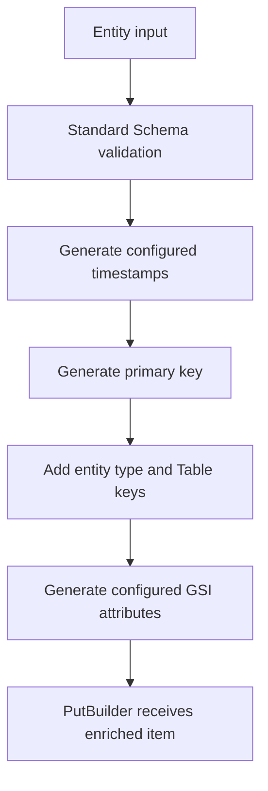

# Entity keys, indexes, and timestamps

Entity persistence is implemented across `src/entity/create-index.ts`, `item-preparation.ts`, `ddb-indexing.ts`, and `entity-aware-builders.ts`. These files turn declarative index functions into physical Table fields. They are the canonical home for derived-key invariants, not the Table configuration page.

## Index-definition DSL

`createIndex().input(schema)` produces a builder whose `.partitionKey(fn)` must end in `.sortKey(fn)` or `.withoutSortKey()`. The result implements `IndexDefinition`: `generateKey(item)`, `partitionKey`, optional `sortKey`, and `isReadOnly`. Its key functions validate with the supplied Standard Schema first. They must validate synchronously; an async schema result raises `ASYNC_VALIDATION_NOT_SUPPORTED` for index generation.

The resulting index's `name` and physical key attribute defaults are placeholders; the map key used in an entity's `indexes` must match a GSI configured on `Table.gsis`. `GsiKeyBuilder.applyIndexKey()` resolves that Table GSI to write generated strings to its actual physical partition/sort attributes and raises `GSI_NOT_FOUND` if it cannot.

## Create and upsert preparation

`prepareItemAsync` validates caller input, then `finishPreparingItem`:

1. Adds configured `createdAt` and `updatedAt` values if missing.
2. Generates and validates the entity primary key; a table with a sort key requires a generated `sk`.
3. Adds the discriminator (`entityType` by default), physical Table primary-key fields, and all configured GSI key fields.
4. Rejects key generation failures and undefined-like index keys with entity/index errors enriched by context.

The equivalent `prepareItemSync` is used for `.withBatch()`, `.withTransaction()`, and `EntityAwarePutBuilder.debug()`; it intentionally rejects async validation because these APIs need an item immediately. Normal `.execute()` uses `prepareItemAsync`, so it supports an asynchronous validator. `createIndex().input(schema)` is also sync-only because `generateKey()` has to return a key directly; a promise validator raises `ASYNC_VALIDATION_NOT_SUPPORTED`.



This is the write preparation ordering established by `finishPreparingItem`.

## Update behavior and read-only indexes

`repo.update(key, data)` does **not** regenerate the primary table key; the primary-key input only identifies the existing item. `EntityAwareUpdateBuilder.applyEntityUpdates()` adds user changes, a configured `updatedAt`, and `GsiKeyBuilder.buildForUpdate()` output just before command generation/execute/transaction/debug.

For each ordinary index, the builder computes a key from the supplied key-like current data and a merged updated item; it writes the GSI attributes only if the generated key changed. This means an update must provide every attribute required to rebuild any affected non-read-only index. If it cannot, it raises an index-generation error rather than silently writing an invalid index. Index strings containing a detectable `undefined` segment are rejected.

A `.readOnly(true)` index is generated on create/upsert but skipped on update by default. This protects partial updates that lack enough attributes to regenerate it. `.forceIndexRebuild(name | names)` explicitly opts in, deduplicates requested names, validates they exist, and attempts full regeneration. Use it only when the update contains all attributes required by that index.

## Timestamp contract

`settings.timestamps.createdAt` and `updatedAt` each accept `format: "ISO" | "UNIX"` and optional `attributeName`. ISO uses `Date.toISOString()`; UNIX uses seconds. Creation/upsert requests both configured timestamps unless the data already has the default `createdAt`/`updatedAt` field; updates request only `updatedAt`. Custom timestamp names are generated but the existing-value check itself examines `data.createdAt`/`data.updatedAt`, so retain compatibility when changing this behavior.

## Focused tests and change checklist

`src/__tests__/entity-index-update.test.ts` verifies selective GSI regeneration, missing-attribute failure, read-only skipping, forced rebuild, and never updating physical primary key attributes. `entity-timestamps.test.ts` fixes expected timestamp ordering/format semantics with fake clocks. `entity-update.test.ts` and integration variants verify command/service behavior.

When changing this subsystem, inspect the definition DSL, both preparation paths, `GsiKeyBuilder`, and entity update wrapper together; then run:

```bash
pnpm test
pnpm run check-types
pnpm test:int
```

See [repositories](repositories.md) for the API that invokes this lifecycle and [errors and validation](../reference/errors-and-validation.md) for failure handling.