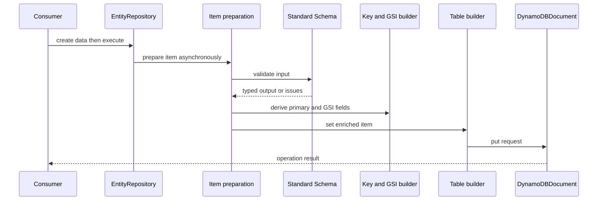

# Entity repositories

`defineEntity` in `src/entity/entity.ts` creates a reusable `EntityDefinition`; `createRepository(table)` binds it to a [`Table`](../table/operations.md). The repository is the high-level API for an item type in a shared table. It turns caller input into a validated and enriched record, protects operations by entity type, and exposes named, domain-level queries.

## Definition contract

`EntityConfig` requires `name`, a `StandardSchemaV1<TInput, T>`, `primaryKey`, and `queries`; it can declare secondary `indexes` and timestamp `settings`. `StandardSchemaV1` is defined and exported from `src/standard-schema.ts`: it has `~standard.version === 1`, a vendor string, and a `validate(value)` method that can return a result or a promise. This is the compatibility boundary for Zod and other Standard Schema v1 providers.

`defineEntity` creates `EntityAwarePutBuilder` around the initial `table.create({})` or `table.put({})` builder. Its `.execute()` calls `prepareItemAsync` and therefore permits an asynchronous Standard Schema validator. Its `.withTransaction()`, `.withBatch()`, and `.debug()` call `prepareItemSync` before registering/rendering a command, so each rejects a promise-returning validator with the entity async-validation error. This is the create/upsert lifecycle; synchronous attachment exists because the item must be ready when attached.

## Repository API and guarantees

| Method | Behavior |
|---|---|
| `create(data)` | Starts from `table.create({})`; validates/prepares only at execute/attachment time and uses create's no-overwrite condition. |
| `upsert(data)` | Starts from `table.put({})`; validates/prepares at execution and returns the enriched item through the wrapper. |
| `get(key)` | Uses `primaryKey.generateKey(key)` and wraps the Table get. |
| `update(key, data)` | Uses primary key, adds `entityTypeAttributeName = name` condition, then applies update timestamps/index fields. |
| `delete(key)` | Uses primary key and adds the same entity-type condition. |
| `scan()` | Adds an entity-type filter to the Table scan. |
| `query.<name>(input)` | Validates declared query input before execution and scopes Query/Scan/Get builders to the entity type. |

The default discriminator is `entityType`, configurable as `settings.entityTypeAttributeName`. This field is written during create/upsert and filters entity query/scan results. Get cannot filter DynamoDB's single-item response; `EntityAwareGetBuilder` is a wrapper, not an entity-type verification step.

## Semantic query seam

Use `createQueries<T>()` to declare `input(schema).query(handler)`. Each handler receives `{ input, entity }`, where `entity` offers only scoped `scan`, `get`, and `query` methods. The returned builder must be one produced by that scoped object (or its recognized clone); otherwise `INVALID_ENTITY_QUERY_BUILDER` is raised. This prevents a named entity query from returning an arbitrary unscoped builder and bypassing the type filter/validation guard.

Query input validation runs through `beforeExecute`; thus for query/scan it occurs before creating the iterator, and for batch get it is registered and run by the batch before network work. A failed validator produces `EntityErrors.queryInputValidationFailed`.

## Safe extension surface

A change to entity behavior crosses `src/entity/entity.ts`, the relevant wrapper in `entity-aware-builders.ts`, preparation/index code, root and `./entity` exports, and focused tests. Preserve deferred timing: create/upsert validation, timestamps, and keys happen at `.execute()` (or synchronous batch/transaction attachment), not at repository method call. Preserve the discriminator condition/filter when adding repository methods.

## Evidence and checks

- `src/__tests__/entity-queries.test.ts` proves deferred create/upsert validation, transformed primary keys, query schema guards, scoped-builder enforcement, and entity filters.
- `src/__tests__/entity-timestamps.test.ts` verifies create/upsert versus update timestamp behavior and custom names/formats.
- `src/__tests__/entity-update.test.ts`, `entity-upsert.test.ts`, `entity-batch.itest.ts`, and `entity-transaction.itest.ts` cover wrappers across execution modes.

Run `pnpm test` for the mocked entity contracts; run `pnpm test:int` with DynamoDB Local for repository operations against the service. Related derived-key rules are canonical in [entity indexes and lifecycle](indexes-and-lifecycle.md).