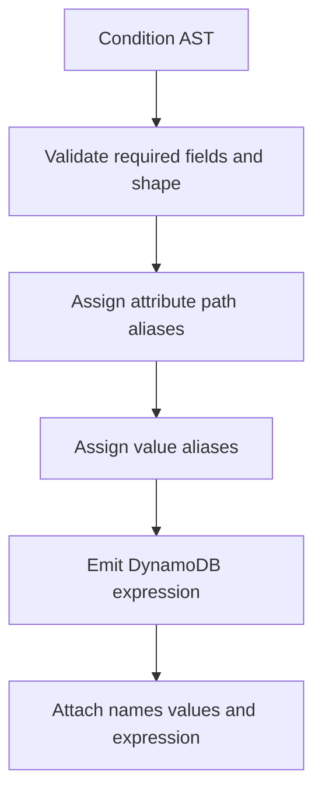

# Conditions and expression compilation

`src/conditions.ts` supplies a serializable `Condition` AST and public helper functions. `src/expression.ts` is the shared compiler that translates that AST into DynamoDB expressions plus `ExpressionAttributeNames` and `ExpressionAttributeValues`. Table query/scan and write/transaction builders all depend on this boundary.

## Public condition language

Comparison helpers are `eq`, `ne`, `lt`, `lte`, `gt`, `gte`, `between`, `inArray`, `beginsWith`, `contains`, `attributeExists`, and `attributeNotExists`. Logical combinators are `and`, `or`, and `not`. `ConditionOperator<T>` mirrors these with typed attribute paths and path value types for builder callbacks. `KeyConditionOperator` is deliberately narrower: equality/range/between/prefix plus `and`, matching valid sort-key operations.

Use direct AST helpers or callback forms, e.g. `builder.condition(op => op.eq("status", "ACTIVE"))`. Repeated builder `.filter()` calls are combined by `FilterBuilder` with `AND`; individual calls may use `or`/`not` to express alternatives.

## Compiler behavior

The compiler aliases every path segment. For `stats.strength`, `generateAttributeName` produces `#0.#1` and maps each alias to a segment. It reuses aliases for repeated segments and increments value aliases through one shared counter, allowing a request's key condition, filter, projection, condition, or update fields to coexist.

`between` requires exactly two values. `inArray` requires one to 100 values. Attribute existence functions require an attribute but no value. `and`/`or` require at least one child; `not` requires exactly its nested condition. Invalid AST shape raises `ExpressionError` via `ExpressionErrors`; it is not passed through to AWS.

`prepareExpressionParams(condition)` is a convenience for write/transaction components: it returns optional expression/names/values, omitting empty maps. Query and scan construct one `ExpressionParams` instance themselves to compile key and filter expressions consistently.

## Scope boundaries

This subsystem describes DynamoDB expressions; it does not decide which key attributes are valid for a configured Table or which entity type is allowed. Table turns logical key input into configured attributes ([Table operations](../table/operations.md)); entities add discriminator filters and schema/key policy ([repositories](../entities/repositories.md)).

When adding an operator, update the operator unions, factory/helper, typed callbacks, compiler dispatch, error validation, root/`./conditions` exports, and both command-level and service-level tests. Do not add an operator merely because it is valid in a general DynamoDB filter if it is invalid in a key condition.

## Tests and validation

`src/builders/__tests__/condition-check-builder.test.ts` asserts nested path aliases, range/functions, logical nesting, and invalid/missing conditions. `query-builder.test.ts` asserts chained filter flattening and mixed `AND`/`OR`; `src/__tests__/in-operator.test.ts` covers the public `IN` behavior. Run `pnpm test`; run `pnpm test:int` for emitted expressions validated by DynamoDB Local.