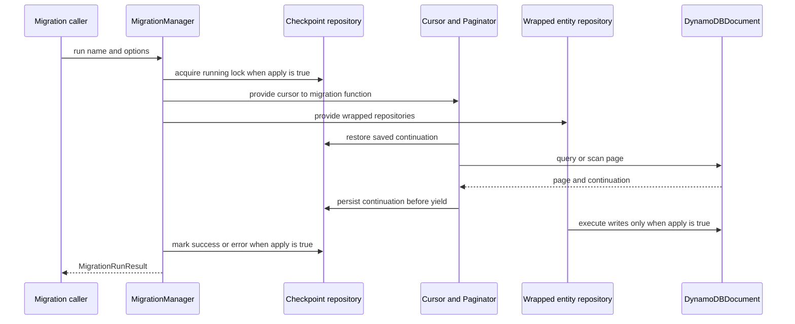
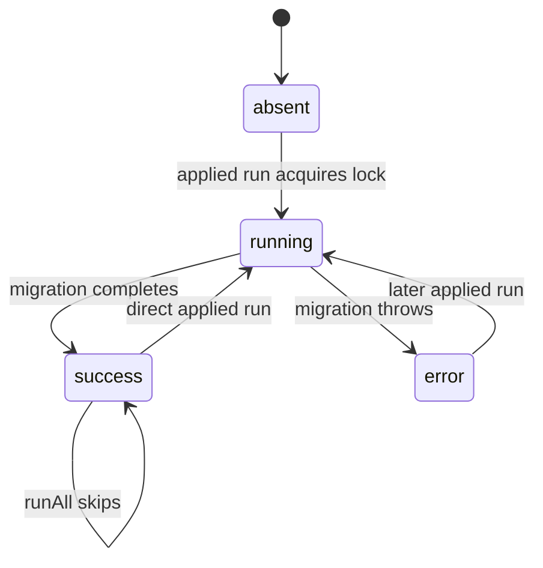

# Resumable entity-repository migrations

`dyno-table/migration` adds `MigrationManager` for backfills and data moves expressed against existing [entity repositories](entities/repositories.md), rather than a separate persistence abstraction. A manager receives the repositories a migration may use plus a regular entity repository that stores one checkpoint record per migration name. Its cursor delegates pagination to the shared [builder execution](builders/execution.md) layer, and its write proxy uses the builders' existing `.debug()` contract for previews.

Import the public surface from `dyno-table/migration`; its published entrypoint and generated package artifacts are part of the [public API contract](reference/public-api.md).

## Execution model



Applied runs acquire the lock before invoking the migration function. Cursor reads and writes, as well as all wrapped repository work, happen inside that function. The cursor persists a returned continuation before it yields that page's items. In a dry run there is no checkpoint or lock traffic, but reads still use DynamoDB so a migration can make decisions from real data.

## Public contract

```ts
const manager = new MigrationManager({ repos, migrationRepo });
manager.createMigration(name, async ({ repos, cursor }) => {
  for await (const item of cursor(repos.items.scan(), { pageSize: 100 })) {
    await repos.items.update({ id: item.id }, { migrated: true }).execute();
  }
});

const preview = await manager.run(name);
const applied = await manager.run(name, { apply: true });
```

- `createMigration(name, fn, { order? })` rejects duplicate names. The default `runAll()` order is registration order; a lower explicit `order` runs first and ties retain registration order.
- `run(name, { apply? })` defaults to dry-run. `MigrationRunResult` reports `name`, `applied`, `scanned`, `writes`, `durationMs`, and, only for dry-runs, `.debug()` `samples` for intercepted writes.
- `runAll(options)` preflights every registered checkpoint. It skips `success`, retries absent/error entries, aborts before starting anything if any is `running`, and stops at the first migration function failure.
- `MigrationCheckpointRepo` is a structural subset of an `EntityRepository`: it needs `get`, `create`, and an update builder with `add`, `remove`, `condition`, and `execute`. A normal checkpoint entity repository satisfies it; its records must include `name`, numeric `version`, and `cursors`.

## Safety and checkpoint invariants

### Dry-run versus applied writes

`wrapRepo` intercepts only `create`, `upsert`, `update`, and `delete`. Each intercepted direct `.execute()` increments `writes`; dry-runs collect `builder.debug()` and do not call the real executor, whereas `{ apply: true }` delegates to it. It also intercepts those write builders' `.withBatch()` and `.withTransaction()` attachment: an applied run delegates the attachment, while a dry run records the command and replaces the supplied deferred builder's `.execute()` with a no-op. `get`, `query`, and `scan` pass through unchanged in both modes. Do not rely on the return value of a write during a dry run: its intercepted execute resolves `undefined`.

### Resuming a cursor

Use the supplied `cursor` around query or scan builders. In applied mode it restores `cursors[id].lastEvaluatedKey` with `builder.startFrom`, then uses `Paginator` with optional `pageSize`. Before yielding any items from a page with a continuation key, it persists that key. Consequently an interruption can reprocess the current page but should not skip it; migration bodies must be idempotent or make their writes conditional.

A completed cursor removes only its own checkpoint slot. Multiple cursors require distinct `id` values; the default is `default`, and calling `cursor()` twice with the same id throws before pagination. Set `pageSize` for a large migration: without it, `Paginator` can drain the source as one logical page before the first checkpoint, making the replay window unbounded.

### Lock and checkpoint lifecycle



Checkpoint `status` is a mutual-exclusion and outcome marker; `cursors` hold resumability state independently. Both cursor patches and status updates use a version-guarded read-modify-write. `patchCheckpoint` retries only `ConditionalCheckFailedException` conflicts, reloading the record each time, up to five retries. The conditional classifier recognizes either a raw AWS error or the `OperationError.cause` produced by Table execution; see [errors and validation](reference/errors-and-validation.md).

There is deliberately no stale-lock timeout. A hard process termination can leave `status: "running"`; inspect and repair that checkpoint record before retrying. A normally thrown migration error is persisted as `status: "error"` with its message, is rethrown to the caller, and leaves already completed page checkpoints in place.

## Change guide and validation

Consult this page when changing migration behavior, the checkpoint record schema, cursor timing, or the `dyno-table/migration` API.

- Preserve the ordering **acquire lock -> invoke migration -> mark success/error** for applied runs. Dry-runs must not lock or mutate checkpoints.
- Preserve checkpoint-before-yield and per-id isolation. Altering it changes crash replay and data-loss behavior.
- If changing the proxy, retain the read/write boundary and validate that all supported entity write builders expose `.debug()`. The proxy intentionally does not add retry policy for user writes.
- For checkpoint changes, retain the `version` conditional update and its bounded conflict retry. Checkpoint creation accepts an already-existing record only when the error is a conditional-check failure.
- For a public type or new migration subpath, update `src/migration/index.ts`, `src/migration.ts`, `tsdown.config.ts`, and `package.json` exports/typesVersions as applicable; then verify the consumer-facing build as described in [public API](reference/public-api.md). Generated `dist/` files are build output, not hand-edited sources.

Focused unit checks are:

```bash
pnpm test -- src/migration/__tests__/migration-manager.test.ts src/migration/__tests__/cursor.test.ts src/migration/__tests__/checkpoint-store.test.ts src/migration/__tests__/repo-proxy.test.ts
```

These cover direct and deferred dry-run interception, applied writes, lock statuses, ordering, cursor resume/checkpoint timing, conflict retries, and id isolation. `cursor-race.itest.ts` additionally demonstrates real conditional-version conflicts between cursor updates rather than merely counting update calls. Run `pnpm test:int -- src/migration/__tests__/migration-manager.itest.ts src/migration/__tests__/cursor-race.itest.ts` only when changing real DynamoDB behavior, concurrency, or repository integration; it requires the DynamoDB Local setup documented in [testing](development/testing.md). A published surface change additionally requires `pnpm run check-types && pnpm run build`.
