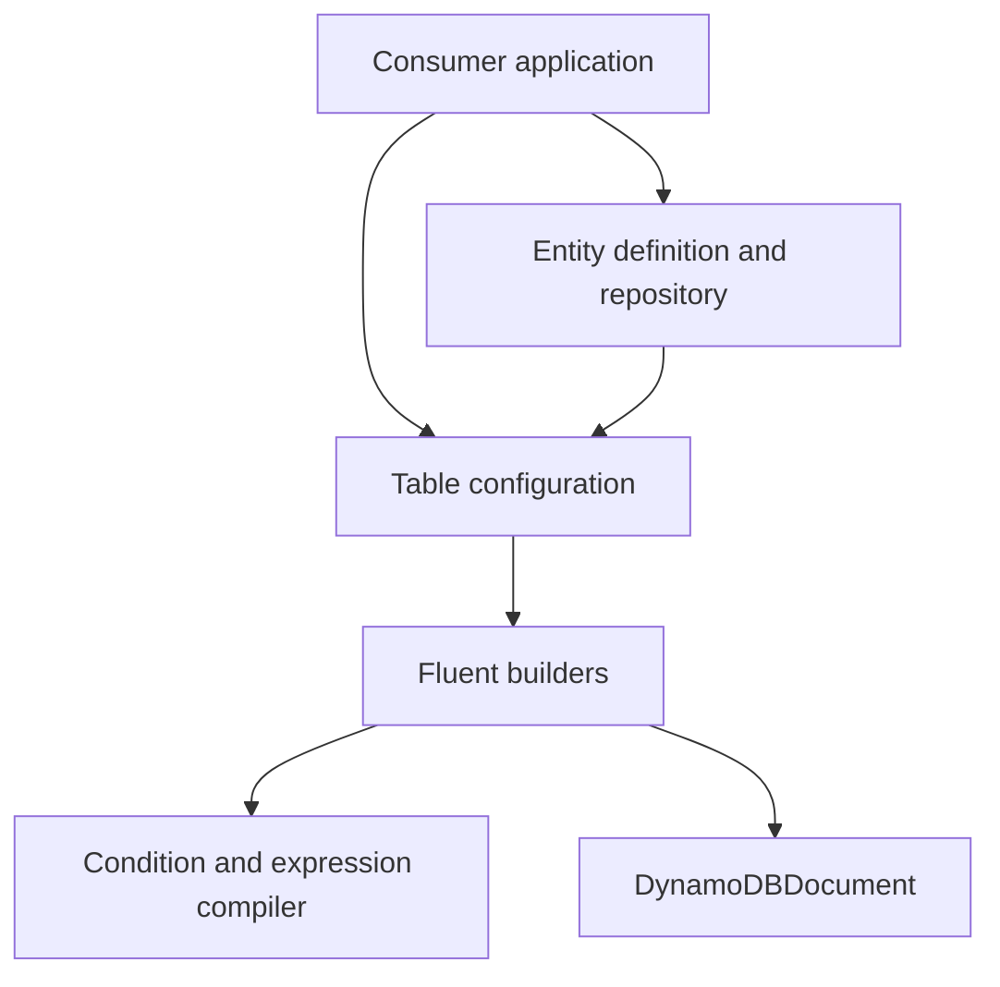

# dyno-table code wiki

`dyno-table` is a published TypeScript library that wraps `DynamoDBDocument` with typed fluent operations. It supports a direct [`Table`](table/operations.md) API and a schema-backed [`EntityRepository`](entities/repositories.md) API; both compile requests through the same builder and expression layers. This wiki is source-grounded in `src/`, focused unit tests, DynamoDB Local integration tests, package configuration, CI, and executable consumers.

## Start with the right model



This shows the two consumer paths converging at the same DynamoDB execution boundary.

- **Direct Table path:** configure physical partition/sort keys and GSI attributes, then create read/write/query/scan builders. Use it when the caller owns stored item shape and key strings. Read [Table operations](table/operations.md) and [runtime](architecture/runtime.md).
- **Entity path:** declare Standard Schema validation, key/index derivation, optional timestamps, and named queries. The repository enriches writes and scopes multi-entity operations. Read [repositories](entities/repositories.md) and [keys indexes and timestamps](entities/indexes-and-lifecycle.md).
- **Collection path:** query an intentionally shared base-table partition or GSI and group each page by configured entity type. It is a read-only wrapper over a normal Table query, not a join. Read [entity collections](entities/collections.md).
- **Shared builder path:** all operations ultimately use mutable fluent builders, command compilers, paginator/iterator, batch, or transactions. Read [builder execution](builders/execution.md) and [conditions and expressions](expressions/conditions.md).
- **Migration path:** `MigrationManager` runs repository-based backfills in preview mode by default, optionally applying writes with checkpointed query/scan cursors. Read [resumable migrations](migration-system.md).

## Wiki map

| Section | Use it to answer |
|---|---|
| [Architecture overview](architecture/overview.md) | What is in the package, which runtime layers exist, and when to choose Table versus Entity? |
| [DynamoDB execution runtime](architecture/runtime.md) | Where do builders become DocumentClient calls, and how are keys, return values, chunks, and failures handled? |
| [Table operations](table/operations.md) | Which low-level methods exist and what do their key/GSI/condition contracts require? |
| [Builder execution](builders/execution.md) | What does `.execute()` do, when are reads lazy, and what are pagination, update, batch, and transaction invariants? |
| [Entity repositories](entities/repositories.md) | How do schemas, entity scoping, semantic queries, and deferred validation work? |
| [Entity collections](entities/collections.md) | How can one shared partition or GSI be queried and grouped into configured entity types? |
| [Entity lifecycle](entities/indexes-and-lifecycle.md) | How are physical primary/GSI keys and timestamps produced or safely refreshed? |
| [Resumable migrations](migration-system.md) | How do repository-based backfills preview writes, resume scans, and avoid concurrent applied runs? |
| [Conditions and expressions](expressions/conditions.md) | How do typed conditions compile safely into DynamoDB expressions? |
| [Public API](reference/public-api.md) | Which package import paths and declarations are compatibility commitments? |
| [Errors and validation](reference/errors-and-validation.md) | Which error types/codes and AWS classifications should callers handle? |
| [Utilities](reference/utilities.md) | How do key templates, readable debug output, and public error helpers behave? |
| [Testing](development/testing.md) | How is DynamoDB Local wired and which command is the narrowest useful check? |
| [CI and release](development/ci-and-release.md) | What gates changes, publishes artifacts, and refreshes this wiki? |
| [Consumer examples](examples/consumer-integration.md) | Which executable downstream patterns are useful regression checks? |

## Task routing

| Change intent | Canonical wiki page | Exact source entrypoints | Important symbols or types | Focused tests | Minimal validation |
|---|---|---|---|---|---|
| Add or change a low-level operation | [Table operations](table/operations.md) | `src/table.ts`, matching `src/builders/*-builder.ts` | `Table`, matching builder | `src/builders/__tests__/*`, matching `src/__tests__/table-*.itest.ts` | `pnpm test`; integration change: `pnpm test:int` |
| Change query, scan, projection, iteration, or pagination | [Builder execution](builders/execution.md) | `src/builders/query-builder.ts`, `scan-builder.ts`, `filter-builder.ts`, `paginator.ts`, `result-iterator.ts` | `QueryBuilder`, `Paginator`, `ResultIterator` | `query-builder.test.ts`, `scan-builder.test.ts`, `table-query-advanced.itest.ts` | `pnpm test` |
| Change segmented parallel scan behavior or merged scan pages | [Builder execution](builders/execution.md#parallel-scans-independent-cursors-merged-results) | `src/builders/scan-builder.ts`, `parallel-scan-iterator.ts`, `src/table.ts` | `ScanBuilder.segments`, `ParallelScanIterator`, `ParallelScanPaginator` | `src/__tests__/scan-parallel.test.ts`, `scan-parallel.itest.ts` | `pnpm test -- src/__tests__/scan-parallel.test.ts`; service semantics: `pnpm test:int -- src/__tests__/scan-parallel.itest.ts` |
| Change update syntax, batching, or transactions | [Builder execution](builders/execution.md) | `src/builders/update-builder.ts`, `batch-builder.ts`, `transaction-builder.ts` | `UpdateBuilder`, `BatchBuilder`, `TransactionBuilder` | `update-builder.test.ts`, `table-batch.itest.ts`, `table-transaction.itest.ts` | `pnpm test`; then `pnpm test:int` |
| Add entity behavior or a semantic query | [Entity repositories](entities/repositories.md) | `src/entity/entity.ts`, `src/entity/entity-aware-builders.ts` | `defineEntity`, `EntityRepository`, `createQueries` | `entity-queries.test.ts` | `pnpm test` |
| Add a shared-index entity collection or change grouping | [Entity collections](entities/collections.md) | `src/entity/collection.ts`, `src/entity.ts` | `defineCollection`, `CollectionPageIterator`, `CollectionResultIterator` | `src/__tests__/entity-collection.test.ts` | `pnpm test -- src/__tests__/entity-collection.test.ts` |
| Add or change a data migration, checkpoint behavior, or dry-run policy | [Resumable migrations](migration-system.md) | `src/migration.ts`, `src/migration/migration-manager.ts`, `cursor.ts`, `checkpoint-store.ts`, `repo-proxy.ts` | `MigrationManager`, `patchCheckpoint`, `wrapRepo` | `migration-manager.test.ts`, `cursor.test.ts`, `checkpoint-store.test.ts`, `repo-proxy.test.ts` | `pnpm test -- src/migration/__tests__/migration-manager.test.ts src/migration/__tests__/cursor.test.ts` |
| Change validation, key templates, timestamps, or GSI refresh | [Entity lifecycle](entities/indexes-and-lifecycle.md) | `src/entity/create-index.ts`, `item-preparation.ts`, `ddb-indexing.ts` | `createIndex`, `prepareItemAsync`, `GsiKeyBuilder` | `entity-index-update.test.ts`, `entity-timestamps.test.ts` | `pnpm test` |
| Add condition operator or alter expression serialization | [Conditions and expressions](expressions/conditions.md) | `src/conditions.ts`, `src/expression.ts` | `Condition`, condition operators | `in-operator.test.ts`, `condition-check-builder.test.ts`, `nested-and-conditions.itest.ts` | `pnpm test` |
| Change a public export or package build | [Public API](reference/public-api.md) | `src/index.ts`, subpath barrels, `package.json`, `tsdown.config.ts` | export map, `typesVersions` | consumer imports/examples | `pnpm run check-types && pnpm run build` |
| Change error shape, error code, or retry classification | [Errors and validation](reference/errors-and-validation.md) | `src/errors.ts`, `src/utils/error-factory.ts`, `src/utils/error-utils.ts` | `OperationError`, error factories | focused builder/entity tests | `pnpm test` |
| Change CI, release, or generated documentation automation | [CI and release](development/ci-and-release.md) | `.github/workflows/`, `.releaserc.json` | workflow and release config | workflow review plus local commands | appropriate workflow and `pnpm run build` |

## Fast local loop

```bash
pnpm test
pnpm run check-types
pnpm run build
```

For service-backed behavior, start the repository DynamoDB Local service, create the test table, run integration tests, then tear it down:

```bash
pnpm run ddb:start
pnpm run local:setup
pnpm run test:int
pnpm run local:teardown
```

See [testing](development/testing.md) for the service topology and why integration work must preserve port `8897`, `TestTable`, configured GSI attributes, and setup/cleanup behavior.

## Backlog

No evidence-blocked or out-of-scope substantial areas were deferred. Existing prose in `/docs` is useful consumer documentation, but this wiki’s canonical maintenance guidance is grounded in current source and tests rather than duplicating every guide.
